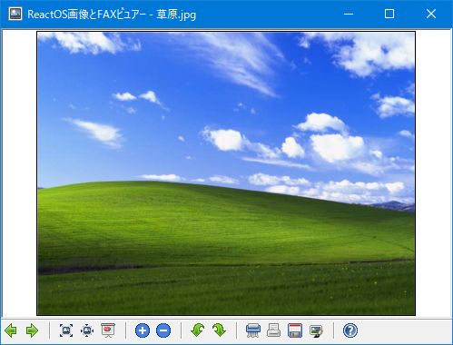

#  Independent ReactOS shimgvw

This is `"Independent ReactOS shimgvw"` from [ReactOS](https://reactos.org/), Shell Image Viewer.



It's a free and open source software for Windows XP and later.

<p align=center>
  <a href="https://reactos.org/">
    
  </a>
</p>

<p align=center>
  <a href="https://reactos.org/donate/">
    
  </a>
  <a href="https://twitter.com/reactos">
    
  </a>
</p>

## Main code contributors

- Dmitry Chapyshev (dmitry@reactos.org)
- Katayama Hirofumi MZ (katayama.hirofumi.mz@gmail.com)
- and more!

## Translators

- Radek Liska aka Black_Fox (radekliska at gmail dot com)
- Václav Zouzalík aka Venca24 (vaclav.zouzalik at seznam dot cz)
- Ferreras Morezuelas (Swyter)
- Vytis Girdžijauskas, CMan (cman@cman.us)
- Rafal Harabien
- Caemyr
- Jose Carlos Jesus zecarlos1957@hotmail.com
- Ștefan Fulea <stefan.fulea@mail.com>
- Andrei Miloiu <miloiuandrei@gmail.com>
- Mário Kačmár /Mario Kacmar/ aka Kario (kario@szm.sk)
- Ardit Dani (Ard1t) (ardit.dani@gmail.com)
- Erdem Ersoy (eersoy93) (erdemersoy [at] erdemersoy [dot] net)
- Igor Paliychuk
- Henry Tang Ih <henrytang2@hotmail.com>
- Luke Luo <njlyf2011@hotmail.com>
- Wu Haotian <rigoligo03@gmail.com>
- Chan Chilung <eason066@gmail.com>
- Henry Tang Ih <henrytang2@hotmail.com>
- and more!

## How to build?

Please use ReactOS Build Environment (RosBE).

```bash
git clone https://github.com/katahiromz/Rshimgvw
cd Rshimgvw
cmake -G Ninja -DCMAKE_BUILD_TYPE=Release .
ninja
strip shimgvw.exe
```

Tested on RosBE and MinGW.

## License

- GPL 2.0
